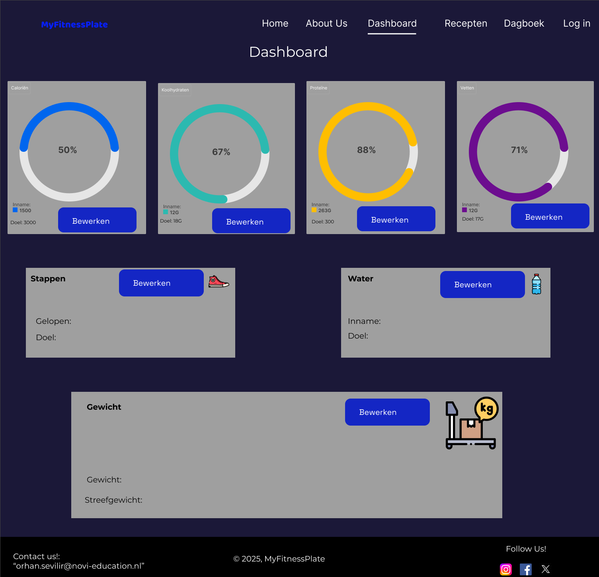

# Installatiehandleiding MyFitnessPlate



## Inleiding 

Van harte welkom bij **MyFitnessPlate**! Deze applicatie is ontwikkeld om gebruikers te ondersteunen bij het behalen van hun gezondheidsdoelen. In MyFitnessPlate kun je je dagelijkse calorieën, eiwitten, koolhydraten en vetten bijhouden, net als je waterinname, stappendoel en gewicht.
Je kunt handmatig voedingsmiddelen toevoegen of recepten zoeken via de geïntegreerde Spooncular API. Daarbij is het mogelijk om te zoeken naar specifieke recepten op basis van naam of juist op basis van macrodoelen zoals calorieën, eiwitten, koolhydraten en vetten. Na het zoeken krijg je per recept een overzichtelijke samenvatting, inclusief bereidingswijze, bereidingstijd, of het gerecht vegan is, en een lijst met ingrediënten.
Daarnaast biedt de app een overzichtelijk dagboek om je eetgeschiedenis terug te zien, en een dashboard dat in één oogopslag je voortgang laat zien.
Of je nu fitter wilt worden, afvallen of gewoon inzicht wilt krijgen in je eetpatroon: **MyFitnessPlate** helpt je op weg. Veel succes en plezier met het gebruik van de app!

## Inhoudsopgave

- Benodigdheden
- Installatie Stappenplan
- Registreren en Inloggen
- De app gebruiken

## Benodigdheden

- **Google Chrome**
-  Ik raad je zeker aan om Chrome te installeren. Deze applicatie is namelijk ontwikkeld en getest in Google Chrome.
- klik [hier] (https://www.google.com/intl/nl/chrome/) om zo de laatste versie van Google Chrome te installeren.

- ## **IDE (naar eigen keuze)** 
- Er is een IDE vereist om de applicatie te draaien.
- Persoonlijk vind ik Visual Studio Code optimaal, maar dat verschilt per persoon. Daarnaast is deze IDE ook gratis.
- Klik [hier](https://code.visualstudio.com/) om Visual Studio Code te installeren. 

**Node.js**
- Node.js is vereist om de commando's in de terminal te kunnen uitvoeren.
- klik [hier](https://nodejs.org/en/download/current) om de laatste versie te installeren van node.js.

**Api Key**
- Indien je een docent van **Novi** bent, dan hoef je zelf geen API key aan te maken. De benodigde gegevens zijn al toegevoegd in het .env- bestand van dit project.
- Wil je als developer zelf een eigen API key genereren om de app lokaal te testen? Volg dan onderstaande stappen:
1. Ga naar [Spooncular-Api](https://spoonacular.com/food-api).
2. Maak gratis een account aan.
3. Vraag een API Key aan via je account-dashboard.
4. Voeg deze toe in een `.env` bestand in de hoofdmap van het project, zoals hieronder:

```env
VITE_API_KEY= jouw_api_key